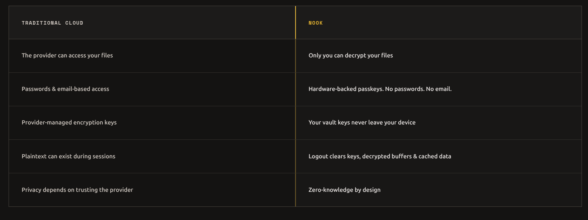
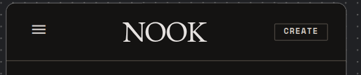
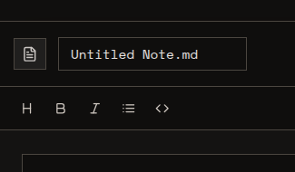
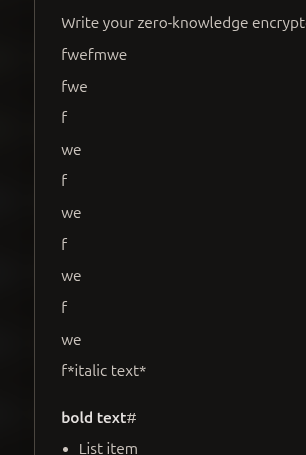

- on the login page cloudflar captcha varification is falling on mobile but works good in pc 

- mobile responsive ui of 03/ divergence 

- mobile nav for landing  ... in the hemburger menu ... keep 01 , 02 ,03, 04 

- once i am in Welcome back or login screen ... remove the create your nook button from nav on both mobile and desktop ... and also the remove the hamburger menu from the mobile 

- the About
Contact
Privacy
Terms ... are not mobile optimized 

- on dashborad ...list mode .. move the eye icon 

- on file views ... of docx, xlsx...ect .. dont force the dark mode ... just keep the original colors of the files

- docx is ok ..but upable to view .odt and .pptx 

- the note taking is not working  ... none of the buttons in markdown editor are working. production not expceted results 

- fix note taker ui for mobile 
 
- Failed to load resource: the server responded with a status of 429 ()
/api/auth/me:1  Failed to load resource: the server responded with a status of 429 ()
/api/auth/me:1  Failed to load resource: the server responded with a status of 429 ()
/api/auth/me:1  Failed to load resource: the server responded with a status of 429 ()
/api/auth/me:1  Failed to load resource: the server responded with a status of 429 ()
/api/auth/me:1  Failed to load resource: the server responded with a status of 429 () ...
this is contiuesly logging on the console ... while i am alrady logged in ... and the site is working as expceted .. then.... index-Czl_sj91.js:53  GET https://vault.adityahota99.workers.dev/api/auth/me 429 (Too Many Requests)
Ft @ index-Czl_sj91.js:53
m @ index-Czl_sj91.js:54
(anonymous) @ index-Czl_sj91.js:364
yo @ index-Czl_sj91.js:48
iv @ index-Czl_sj91.js:48
ea @ index-Czl_sj91.js:48
iv @ index-Czl_sj91.js:48
ea @ index-Czl_sj91.js:48
iv @ index-Czl_sj91.js:48
ea @ index-Czl_sj91.js:48
iv @ index-Czl_sj91.js:48

- if the user goes back or reload the site or any attempt to leave the site .. they need to enter the passphress again ... tab switching is not included ... also if the site is open for a long time (more then 30 min) and the user comes back .. they need to enter the passphress again 
